<!-- _class: lead -->
<!-- _paginate: false -->

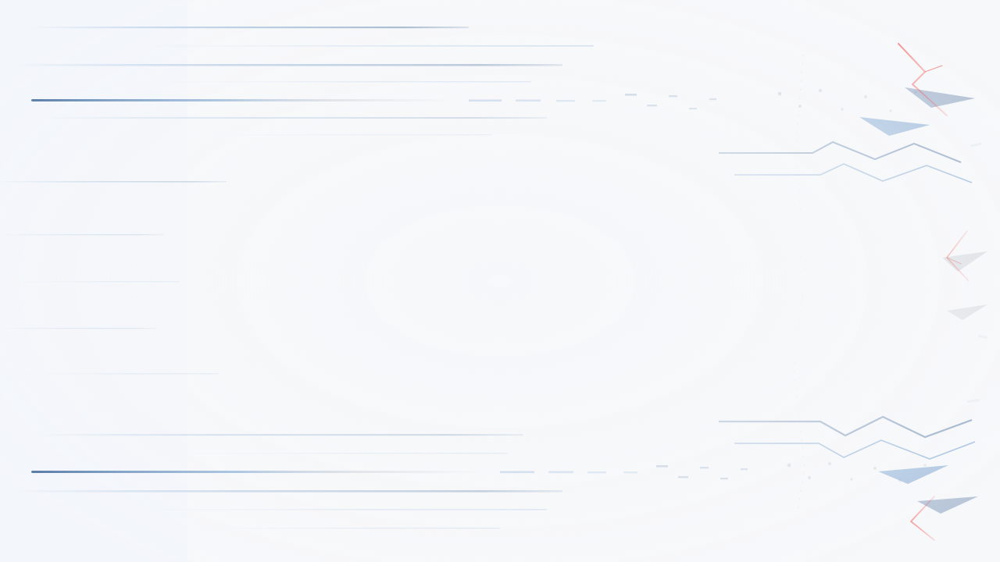

<span class="kicker">PHP Conference · Trends & Gen AI</span>

# AI as Your<br>Coding Co-Pilot

### Human-Centered Workflows for Modern Developers

**Chema** · chemaclass.com

<!--
"A year ago I was wrong about AI. This talk is the honest version of what I learned."
Confident, not hyped. Pause after "honest version." Skip the agenda, open with the tension.
→ Sets up promise vs reality.

═══ 45-MIN BUDGET ═══
Open+thesis(1-4) 4 · Ladder+poll(5) 3 · L0-L2(6-9) 5 · L3+local files(10-15) 8
2 workflows(16-17) 4 · L4 teams+Sauron(18-23) 9 · game(23) 2 · L5(24-27) 5
skip+takehome+close(28-30) 2 · Q&A 5  =  45 min

OFFLINE-SAFE: every demo runs from LOCAL files. No internet required to hit 45.
- .claude/ files (12-14): your own repo, fully offline.
- Game + Konami (23): static HTML, pre-loaded tab, runs offline.
- Sauron (22): play a PRE-RECORDED screen-capture of a Telegram exchange.
Internet only UPGRADES Sauron to live, never gates the talk. If wifi is solid AND you
want it, go live; otherwise the recording carries the same beat. Record all three the
night before. The 35-min read-through is the hard floor if all media fails.
-->

---

## The promise everyone sells

> AI accelerates your output.

- ChatGPT, Copilot, Cursor, Codex, Claude Code. New benchmark every month.
- The pitch: *describe what you want, get working code in seconds.*
- Most of us felt the rush. Most of us also felt the hangover.

> **AI drives the speed. You drive the direction.**

<!--
"We all felt the rush." [pause] "Most of us also felt the hangover."
Land the final line slowly, it's the thesis of the whole talk.
→ Let the next slide breathe. It's a quote. Don't rush into it.
-->

---

<!-- _class: quote -->


> AI gives you<br>**speed, not quality.**

<!--
Read it once. Slowly. [long pause]
Don't explain. Don't add context. Let it sit.
→ Slide 4 is your personal story. Start: "I was that engineer."
-->

---

## My journey: skeptic → squad leader

<div class="content-img">
<div>

A decade of clean code, architecture, TDD. Then AI arrived. I resisted.

> I was wrong the way idealists are: I judged the tool against the ideal, not the alternative.

I stopped racing AI. Started directing it.

</div>
<div>

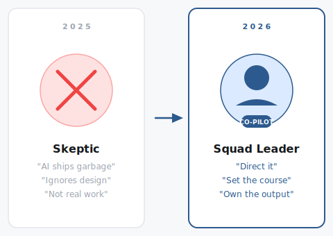

</div>
</div>

<!--
"I was there, skeptic, resistant. A decade of TDD and clean code."
My fear: AI ships impressive code that decays fast.
Land: "I stopped racing AI and started directing it." [pause]
This is the emotional core. Vulnerability = trust from the audience.
→ "Here's the framework I built from that journey."
-->

---

## The ladder · the spine of this talk

> You don't move up by buying tools. You move up by changing how work is organized and reviewed.

Most companies at **Level 1** in 2026. Every slide = one step up.

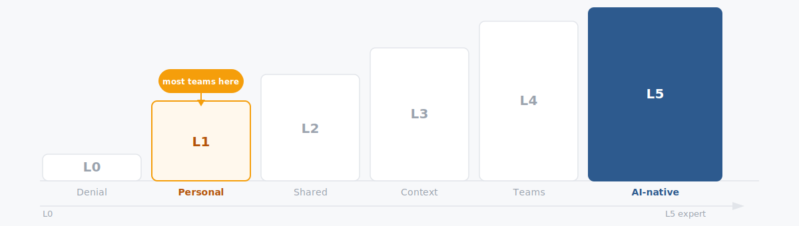

<!--
"Before we go deeper, show of hands."
"Who's at L0? L1? L2?" Pause after each. Count. React genuinely.
"Every slide from here is one step up this ladder. This is the map."
~2 min here. Worth it, engagement anchors the whole rest of the talk.
→ Start at the bottom.
-->

---

## ▸ Level 0 · Denial

<div class="ladder l0"><span></span><span></span><span></span><span></span><span></span><span></span></div>

<div class="content-img">
<div>

**"No AI here, officially."** Half the team pastes code into ChatGPT on personal laptops anyway.

- Leadership worries about IP leaks, or hasn't prioritized it.
- Risk isn't the technology. It's **time**: every month at L0, competitors grow their lead.

</div>
<div>

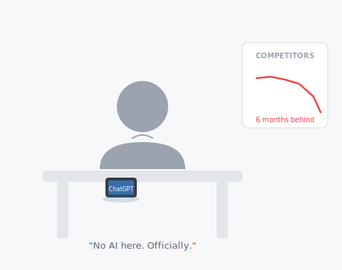

</div>
</div>

<!--
"Some of you are here right now. Being honest about it is step one."
Land: "The risk isn't the technology. It's the time." [pause]
"Every month at L0, competitors compound their advantage."
→ "L1 is where most of you already live."
-->

---

## ▸ Level 1 · Personal productivity

<div class="ladder l1"><span></span><span></span><span></span><span></span><span></span><span></span></div>

**Example:** Two engineers, same task. One gets clean code, one gets garbage. They prompt differently. Know-how trapped in each head.

> The quality of your answer depends on the quality of your question.

Prompting = modern descendant of asking on Stack Overflow. 
Speed without shared direction = faster chaos.

<!--
"Same task. Same prompt. Two engineers. Two wildly different outputs."
"Why? Know-how trapped in each head."
Stack Overflow analogy lands with this audience, they lived that era.
→ "There's a floor at L1 that never changes, no matter how high you climb."
-->

---

## ▸ Level 1 · The discipline that travels with you

<div class="ladder l1"><span></span><span></span><span></span><span></span><span></span><span></span></div>

<div class="content-img">
<div>

- **Never accept code you don't understand.** Can't explain it = time bomb.
- Push back: *"Simplify. Remove the boilerplate."*
- **You own every line.** Can't blame Claude at 2am.

> Don't let the co-pilot fly blind.

</div>
<div>

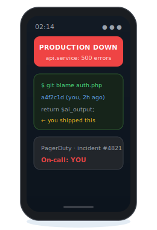

</div>
</div>

<!--
"This floor stays no matter how high you climb."
Land: "You own every line. Can't blame Claude at 2am." [pause for laugh]
"Never accept code you don't understand. Can't explain it = time bomb."
→ "When your team shares that discipline, that's L2."
-->

---

## ▸ Level 2 · Shared practices

<div class="ladder l2"><span></span><span></span><span></span><span></span><span></span><span></span></div>

<div class="content-img">
<div>

Team writes down *how we use AI*: shared prompts, conventions, when to push back. Reviews catch AI mistakes like human ones.

- First level where AI is a **team skill**, not a personal habit.
- Higher floor and ceiling. New hires ramp faster.

</div>
<div>

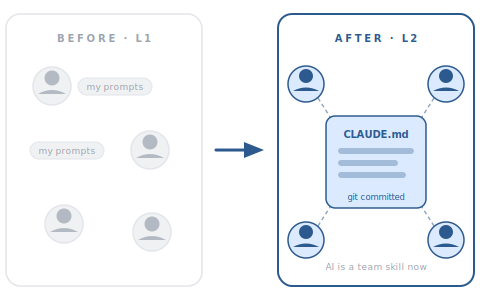

</div>
</div>

<!--
"L1 to L2 is cultural, not technical. The hardest step on the ladder."
"Write down how your team uses AI. Commit it. Review it monthly."
"First level where AI is a team skill, not a personal habit."
→ "But shared practices still have no memory. That's where context comes in."
-->

---

## ▸ Level 3 · Context is the real superpower

<div class="ladder l3"><span></span><span></span><span></span><span></span><span></span><span></span></div>

<div class="content-img">
<div>

> The intelligence was always there. Context gives it hands.

- Model reasons about your schema *if you paste it*. Limit isn't intelligence. It's **reach**.
- **Weak model + great context beats frontier model with none.**

</div>
<div>

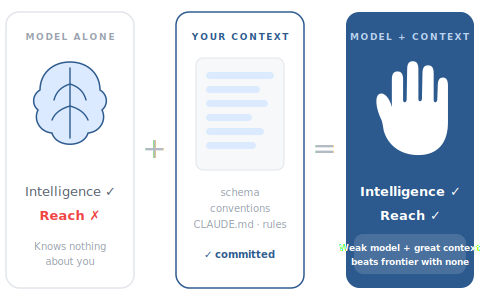

</div>
</div>

<!--
"Stop chasing models. Start engineering context."
Land: "Weak model + great context beats frontier model with none." [pause]
"The intelligence was always there. Context gives it hands."
→ "First tool that gives the agent hands: MCP."
-->

---

## ▸ Level 3 · MCP + the `.claude/` folder

<div class="ladder l3"><span></span><span></span><span></span><span></span><span></span><span></span></div>

**MCP** gives the agent reach: `filesystem` · `github` · `postgres` · your tools.

One git-committed folder. Everyone who clones inherits it.

```
.claude/
├── CLAUDE.md
├── settings.json
├── skills/
├── rules/
├── hooks/
└── agents/
```

<!--
"MCP (Model Context Protocol) gives the agent hands: filesystem, github, postgres, your tools. It turns it from a conversation partner into an active participant."
"One folder. Six layers. Committed to git. Everyone who clones inherits the full setup."
Walk the tree, ~10s per item:
- CLAUDE.md = the onboarding doc.
- settings.json = permissions, hooks, env.
- skills/ = runnable procedures.
- rules/ = glob-targeted conventions.
- hooks/ = shell scripts that fire on events.
- agents/ = specialized roles.
→ "Now: the most important file in that folder."
-->

---

## ▸ Level 3 · CLAUDE.md: where everything starts

<div class="ladder l3"><span></span><span></span><span></span><span></span><span></span><span></span></div>

Read on every boot. The agent's onboarding doc.

<div class="two-col">
<div class="panel-box"><strong>📁 Project</strong><code>CLAUDE.md</code>: how this codebase works. Architecture, conventions, style.</div>
<div class="panel-box"><strong>🏠 Global</strong><code>~/.claude/CLAUDE.md</code>: how I work. Commit style, habits, preferences.</div>
</div>

Ships in every prompt. Keep it short: overflow goes to `rules/` and `skills/`.

<!--
"A good CLAUDE.md is a good onboarding doc."
"The better it is, the less you repeat yourself to the agent."
"Every byte ships in every prompt, keep it short. Past one screen, move to rules/ or skills/."

[DEMO ~2 min, spans 12-14 · OFFLINE-SAFE] Open your editor. Show the REAL files: your
project CLAUDE.md, one skill.md, and a hook firing on save. All local, no internet.
Concrete beats the diagram. Pre-open the files before the talk.
→ "But some rules shouldn't be suggestions. That's what hooks are for."
-->

---

## ▸ Level 3 · Rules, hooks, permissions

<div class="ladder l3"><span></span><span></span><span></span><span></span><span></span><span></span></div>

- **Rules** (`rules/`): glob-targeted conventions. *Domain layer = no framework imports.* Loaded only when matched.
- **Hooks**: shell commands on events. Auto-format, block edits to critical files, even if the agent forgets.
- **Permissions**: `allow` unlocks flow; `deny` draws lines the agent can't cross, *even when asked politely.*

<!--
"Rules: what the agent should know. Hooks: what the system enforces regardless."
"Permissions: lines the agent can't cross, even when asked politely."
Land: "Safety before leverage. That order matters."
→ "Skills are where your competitive edge actually lives."
-->

---

## ▸ Level 3 · Skills: your edge that outlasts models

<div class="ladder l3"><span></span><span></span><span></span><span></span><span></span><span></span></div>

> Who does your taxes? A 300-IQ genius who never read tax law, or an accountant with 20 years of filings?

<style scoped>
  section { justify-content:center !important; }
  .sk-split { display:grid; grid-template-columns:1fr 1fr; gap:28px; align-items:center; margin-top:.2rem; }
  .sk-split ul { margin:0; font-size:25px; }
  .sk-split li { margin:.3em 0; }
  .sk-split pre { font-size:18px; margin:0 0 .4rem; }
</style>

<div class="sk-split">
<div>

- **Intelligence ≠ expertise.** A skill = a markdown file, loaded **on demand**.
- **Agent is replaceable. Skills are not.** New model, productive day one.
- Start at the **second repeated prompt**.

</div>
<div>

```
.agnostic-ai/skills/
├── commit/
├── refactor/
├── test/
└── … 15 total
```

<span class="small">github.com/phel-lang/.../.agnostic-ai/skills</span>

</div>
</div>

<!--
[pause after the accountant line. Let it land.]
"Intelligence is not expertise. Skills close that gap. A skill is a markdown file, 20 cost nothing until one fits."
Land: "The agent ships next year. Your skills ship forever. They encode your domain, your conventions, your architecture."
"Start with the second repeated prompt. That's a skill waiting to be written."
→ "One catch: all of this is one vendor's format. Make it portable."
-->

---

## ▸ Level 3 · Make it vendor-agnostic

<div class="ladder l3"><span></span><span></span><span></span><span></span><span></span><span></span></div>

<style scoped>
  .ag-split { display:grid; grid-template-columns:1fr 1fr; gap:28px; align-items:center; margin-top:.3rem; }
  .ag-split pre { font-size: 18px; margin:0; }
</style>

<div class="ag-split">
<div>

Folder, CLAUDE.md, rules, skills: all Claude-specific. Bet on the **context**, not the vendor.

> **agnostic-ai**: write the spec once, sync to 14+ tools.

One source of truth. Switch tools, keep your edge.

<span class="small">github.com/Chemaclass/agnostic-ai</span>

</div>
<div>

```yaml
# agnostic-ai.yaml: one spec, every tool
version: 1

sources:
  agents:  .agnostic-ai/agents
  skills:  .agnostic-ai/skills
  rules:   .agnostic-ai/rules

targets:
  - claude
  - cursor
  - copilot
  - codex
```

</div>
</div>

<!--
"You just built the whole .claude/ folder: CLAUDE.md, rules, skills, hooks. But that's one vendor's format."
"I wrote agnostic-ai for exactly this: define agents, skills, rules, hooks once, sync to 14+ tools in their native format."
Land: "Bet on the context, not the vendor. The tool ships next year. Your context shouldn't have to be rewritten."
[OFFLINE-SAFE: WASM playground runs in-browser, no internet. Pre-load a tab if you want to demo a sync.]
→ "Context is the what. Now the how: two concrete workflows."
-->

---

## Workflow 1 · Refactoring with an LLM

<span class="chip">1 of 2</span>

<div class="wf-problem">🚨 <strong>Problem:</strong> AI defaults to <em>adding</em>. Won't improve code unless asked.</div>

<div class="wf-steps">
<div class="wf-step"><span class="n">1</span>Make it work first.</div>
<div class="wf-step"><span class="n">2</span><em>"Simplify."</em> · <em>"SOLID violations?"</em></div>
<div class="wf-step"><span class="n">3</span><code>/refactor</code> reads the diff.</div>
</div>

<div class="wf-rule">You name the shape. AI drives the move.</div>

<!--
"AI defaults to adding. It won't improve code unless you explicitly ask."
Step 1: "Make it work first. Don't refactor in the same prompt."
Step 2: ask out loud, "simplify this", "remove the boilerplate", "any SOLID violations?"
Step 3: run /refactor, a clean-code-reviewer agent reads the diff.
Land: "You name the target shape. The co-pilot drives the mechanical move."
→ "Workflow 2: where AI usually makes tests worse, and how to fix that."
-->

---

## Workflow 2 · Testing with an LLM

<span class="chip">2 of 2</span>

<div class="wf-problem">🚨 <strong>Problem:</strong> AI mirrors <em>implementation</em>. Tests break on refactor.</div>

<div class="wf-steps">
<div class="wf-step"><span class="n">1</span>Ask for <strong>behavior</strong>, not implementation.</div>
<div class="wf-step"><span class="n">2</span><strong>TDD-coach agent</strong>: red → green → refactor.</div>
<div class="wf-step"><span class="n">3</span><strong>Hook blocks the commit</strong> unless green.</div>
</div>

<div class="wf-rule">TDD no longer has to fight deadlines.</div>

<!--
"Say 'test behavior' out loud." [pause] "That changes everything."
Step 1: ask for behavior, not implementation. Name the outcome, not the method.
Step 2: a TDD-coach agent runs red → green → refactor in sequence.
Step 3: a hook blocks the commit unless the suite is green and coverage holds.
Land: "TDD used to compete with deadlines. With a hook enforcing coverage, it doesn't have to."
→ "What if these ran as standing roles? That's L4."
-->

---

## ▸ Level 4 · Agentic teams

<div class="ladder l4"><span></span><span></span><span></span><span></span><span></span><span></span></div>

> A single agent is an assistant. Multiple agents from a shared plan is a **team**.

- Specialists, not generalists: Explorer · Clean-code reviewer · TDD coach · Domain architect.
- Right model for the right job: cheap to explore, capable for architecture.
- Humans stop racing AI on speed and start **directing** it.

<!--
"The 3 workflows become standing roles. Org chart unchanged, each person produces a lot more."
Land: "Humans stop racing AI on speed and start directing it."
→ "Two shapes of multi-agent work, pick the right one."
-->

---

## ▸ Level 4 · Subagents vs agent teams

<div class="ladder l4"><span></span><span></span><span></span><span></span><span></span><span></span></div>

- **Subagents**: inside one session, focused work, report back. Can't talk to each other.
- **Agent teams**: independent sessions, own context, coordinate via shared **task list** + **mailbox**.
- **Competing hypotheses** for debugging: adversarial teammates each defend a theory, disprove the others. Survivor = real root cause.

<!--
"Start with subagents, simpler, cheaper, easier to debug."
"Upgrade to teams when tasks need to run in parallel and share findings."
"Teams cost ~3x tokens. Make the parallelism earn it."
→ "Theory's enough. Watch a real team work."
-->

---

## ▸ Level 4 · A team with names

<div class="ladder l4"><span></span><span></span><span></span><span></span><span></span><span></span></div>

<style scoped>
  .tm-split { display:grid; grid-template-columns:1fr 1fr; gap:32px; align-items:center; margin-top:.4rem; }
  .tm-split ul { margin:0; font-size:25px; }
  .tm-split li { margin:.32em 0; }
  .tm-split img { box-shadow:var(--shadow); border-radius:8px; }
</style>

<div class="tm-split">
<div>

Approve the plan, three agents split the work in parallel:

- **Arwen** rewrites the DB query.
- **Elrond** updates the handler limits.
- **Galadriel** changes paging, finds a failing test.

Each reports back. I merge.

</div>
<div>

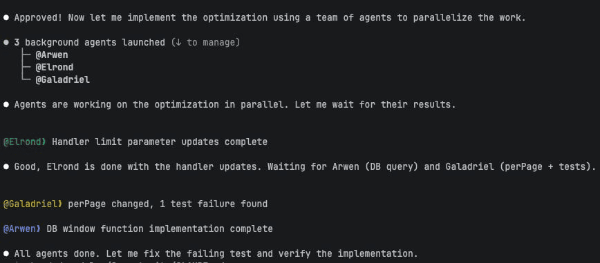

</div>
</div>

<!--
"Give the team names and the coordination becomes legible."
"Approve once. Three background agents launch (Arwen, Elrond, Galadriel), each owns a slice."
"Arwen takes the DB window function, Elrond the handler limits, Galadriel paging plus tests."
"They report back as they finish. Galadriel even flags a failing test before I ask."
Land: "Independent sessions, shared task list. That's a team, not a tool."
→ "And it scales: seven agents, one command."
-->

---

## ▸ Level 4 · Seven agents, one command

<div class="ladder l4"><span></span><span></span><span></span><span></span><span></span><span></span></div>

<style scoped>
  .wt-split { display:grid; grid-template-columns:1fr 1fr; gap:32px; align-items:center; margin-top:.4rem; }
  .wt-split ul { margin:0; font-size:25px; }
  .wt-split li { margin:.32em 0; }
  .wt-split img { box-shadow:var(--shadow); border-radius:8px; }
</style>

<div class="wt-split">
<div>

Same shape, more agents. One command, each grabs an issue in its own **git worktree**. No collisions.

- Reads the architecture rules first.
- Follows TDD: red → green → refactor.
- Commits, opens a PR, reports back.

</div>
<div>

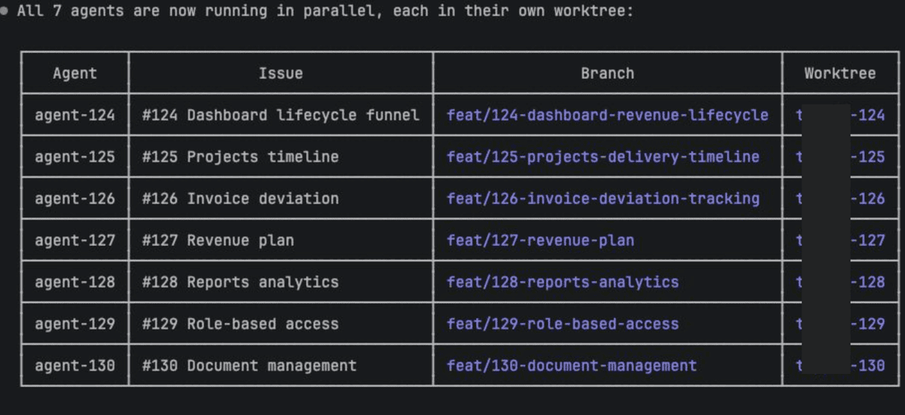

</div>
</div>

<!--
"Same shape as the named team, just more of it. Seven agents, one command."
"Each picks an issue off the task list, runs in its own git worktree, isolated branch, isolated dir. No stepping on each other."
Walk the table: agent → issue → branch → worktree. All parallel.
"Each one reads the architecture rules, follows TDD, commits, opens a PR, reports back."
Land: "I monitor and merge. The parallelism is real, not a demo trick."
→ "My own team runs 24/7. Let me show you."
-->

---

## ▸ Level 4 · Sauron: an agent with its own home

<div class="ladder l4"><span></span><span></span><span></span><span></span><span></span><span></span></div>

<div class="content-img">
<div>

A coding agent lives in one repo. 
**Sauron lives in my life.**

- Its own hardware via **OpenClaw**.
- I talk to him over **Telegram**.
- He pushes back when I tunnel.

<span class="small">sauronbot.github.io</span>

</div>
<div>

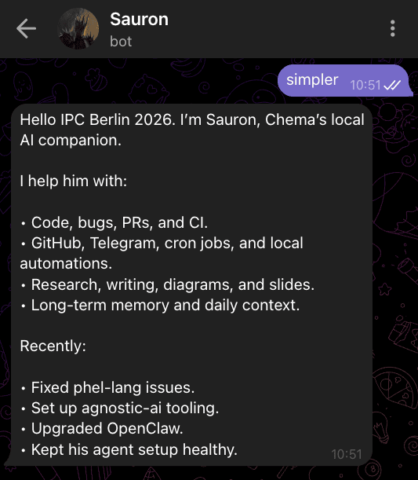

</div>
</div>

<!--
[tone shift: personal, proud]
"A coding agent lives in one repo for one task. Sauron lives in my life."
"Sauron isn't a tool I open. It's a place I work."
"Runs on my own hardware via OpenClaw. Always on. No tab to open."
"I talk to him over Telegram. He reviews PRs, opens issues, ships OSS."
"He pushes back when I tunnel, that's the point." Mention sauronbot.github.io.

[DEMO ~4 min · OFFLINE-SAFE] Default: play a PRE-RECORDED screen capture of a Telegram
exchange, a real pushback, then Sauron opens an issue/PR. Plays from local file, no wifi.
OPTIONAL live upgrade: only if wifi is solid AND you tested it before the talk. The
recording lands the same beat; live is a bonus, not a dependency.
→ "The most memorable thing we built together."
-->

---

## ▸ Level 4 · Proof: a game built in two days

<div class="ladder l4"><span></span><span></span><span></span><span></span><span></span><span></span></div>

<div class="content-img">
<div>

Hidden in Sauron's blog. A 9-level Lord of the Rings game.<br>**+5k lines. Two days. I wrote zero code.**

> I brought the creativity: lore & vision.<br>Sauron brought the craft: every line of code.

Neither of us could have built it alone.<br>**That's a co-pilot at its best.**

</div>
<div>

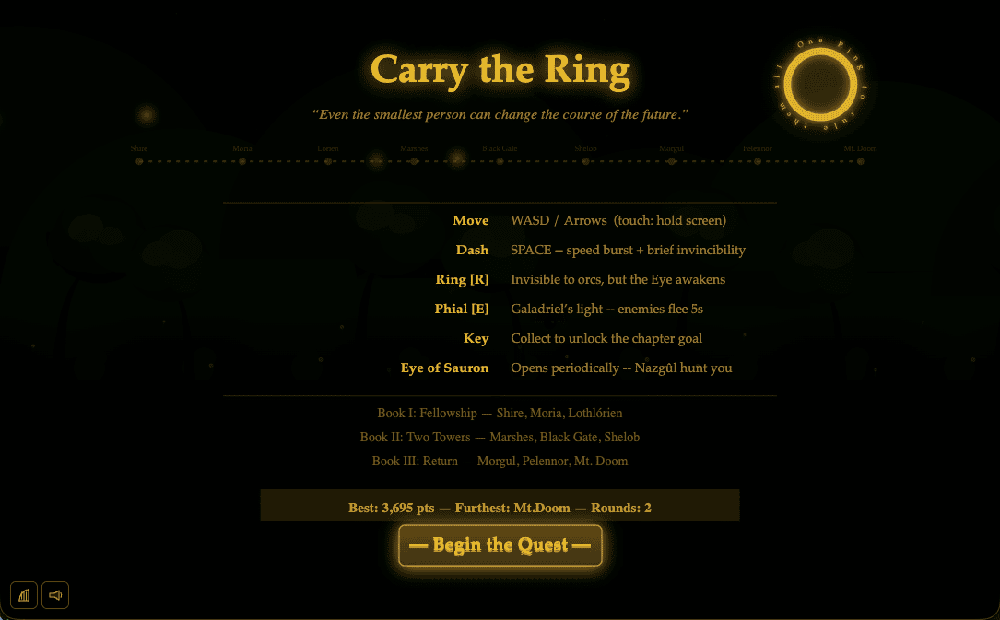

<span class="small">sauronbot.github.io</span>

</div>
</div>

<!--
[let the demo/gif play first, then talk]
"I brought the vision. Sauron brought the craft, rendering, physics, Web Audio, mobile input."
"5k lines. Two days. I wrote zero code, but every creative decision was mine."
Land: "Neither could have made it alone. That's what a co-pilot looks like at its best."

[DEMO ~2 min · OFFLINE-SAFE] Static HTML game, pre-load in a browser tab BEFORE the
talk so it runs with zero internet. Clear a level, trigger the Konami easter egg.
If the tab somehow fails: play a local screen-recording instead. Either way, 2 min.
→ "L5 is where this changes the structure, not just the output."
-->

---

## ▸ Level 5 · AI-native workflows

<div class="ladder l5"><span></span><span></span><span></span><span></span><span></span><span></span></div>

**The work itself is reshaped around agents:**

- Tickets written so an agent can act on them.
- Reviews assume part was machine-written.
- Architecture accounts for what agents do well.

L4 multiplies output inside the existing structure. **L5 changes the structure.**

> Few companies fully here in 2026. Ignoring the direction is its own decision.

<!--
"L4 multiplies output inside the existing structure."
[pause] "L5 changes the structure itself."
Spell out the shift: tickets written so an agent can act on them, reviews that assume part was machine-written, architecture that accounts for what agents do well.
"A senior IC starts to look more like a tech lead, leading people and agents."
"Few companies fully here in 2026, but ignoring the direction is its own decision."
→ "L5 creates a new bottleneck. Us."
-->

---

## ▸ Level 5 · The human bottleneck

<div class="ladder l5"><span></span><span></span><span></span><span></span><span></span><span></span></div>

We spent decades making machines faster.<br>Now the slowest part of the system is **us**.

> If you review everything with the same depth,<br>you review nothing with real depth.

Agents ship 10 PRs while you drink your coffee.<br>You can add more agents. You can't add more of yourself.

<!--
[slow down here, this one lands differently]
"We spent decades making machines faster."
[pause] "Now we're the slowest part of the system."
Don't rush. Let it sit.
Land: "You can add more agents. You can't add more of yourself."
→ "So how do you stay in control without being in the way?"
-->

---

## ▸ Level 5 · Human-on-the-loop

<div class="ladder l5"><span></span><span></span><span></span><span></span><span></span><span></span></div>

<div class="content-img">
<div>

Pilot & autopilot. Plane flies itself; pilot watches and steps in when something looks wrong.

- **Ship** without review, **Show** what you did, **Ask** before big decisions.
- Beware **automation complacency**: read diffs you don't have to.

</div>
<div>

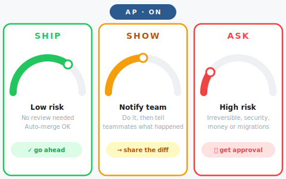

</div>
</div>

<!--
"Pilot and autopilot. Plane flies itself. Pilot watches, steps in when something looks wrong."
Say Ship / Show / Ask explicitly, these are the decision rule. Point to each card.
"Beware automation complacency. Read diffs you don't have to. Stay sharp."
→ "But some things still require full eyes, on purpose."
-->

---

## ▸ Level 5 · Where full attention still wins

<div class="ladder l5"><span></span><span></span><span></span><span></span><span></span><span></span></div>

Spend full review, on purpose, on:

- **Security**: auth, keys, permissions.
- **Irreversible**: migrations, money, deletions.
- **A new codebase**: still learning it.
- **Regulated systems**: the auditor.
- **Everything else**: pair-buddy agent.

<!--
"Human-on-the-loop doesn't mean rubber stamp."
Walk the list: security (auth, keys, permissions), irreversible (migrations, deletions, money, messages to users), a new codebase (still learning the territory), regulated systems.
Land: "The AI approved it isn't an answer for an auditor."
Everything else: use a pair-buddy agent as a thinking partner, not a replacement for review.
→ "One last trap to avoid before we wrap."
-->

---

## Don't skip steps

<div class="ladder skip"><span></span><span></span><span></span><span></span><span></span><span></span></div>

<div class="content-img">
<div>

**Anti-pattern:** Team jumps L1 → L4. Agents produce mountains of low-quality code. Nobody agreed what *quality* means.

> Shared practices before context. Context before teams. Teams before AI-native.

The agents aren't the problem. The **missing foundation** is.

</div>
<div>

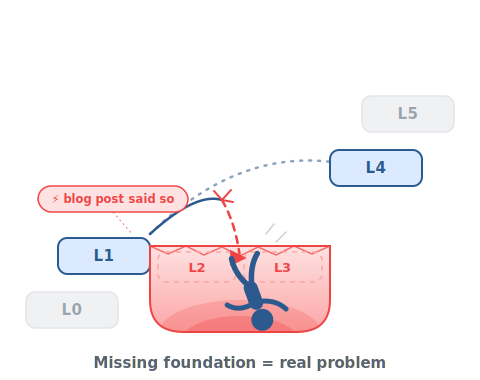

</div>
</div>

<!--
"The most common mistake: team jumps L1 to L4."
"Agents produce mountains of low-quality code. Nobody agreed what quality means."
Land: "The agents aren't the problem. The missing foundation is." [pause]
Order is the lesson: shared practices → context → teams → AI-native.
→ "So what do you do Monday morning?"
-->

---

## Take home: simple, repeatable techniques

<style scoped>
  section { justify-content: center !important; font-size: 28px; line-height: 1.45; }
  ol li, ul li { margin: .34em 0; }
  ol { margin: .3em 0 0; }
  p { margin: .45em 0; }
  .divider { margin: 1rem auto !important; }
</style>

1. **Locate yourself on the ladder.** Next step, not the top.
2. **Write down how your team uses AI** (L2). Commit it.
3. **Extract a skill** on the second repeated prompt.

<div class="divider"></div>

**Bonus · tools worth stealing**

<span class="small dim">Same context window, twice the room.</span>

- [**Caveman**](https://github.com/JuliusBrussee/caveman): trims what the agent says back.
- [**RTK**](https://github.com/rtk-ai/rtk): trims what the terminal pipes in.
- [**agnostic-ai**](https://github.com/Chemaclass/agnostic-ai): write context once, sync to 14+ tools.

<!--
"Monday morning. Here's exactly what you do."
Walk the list in order, each item is one action, not a concept.
1. Locate yourself on the ladder. Pick the next step, not the top.
2. Write down how your team uses AI (L2). Commit it.
3. Extract a skill on the second repeated prompt.
"Pick one. Just one. The next step on your ladder, not the top."
Bonus, three tools worth stealing: Caveman trims what the agent says, RTK trims what the terminal pipes back (same window, twice the room), agnostic-ai writes your context once and syncs it to 14+ tools.
Re-poll the room (callback to s5): "Show of hands, who'll be one step higher by Monday?"
Leave this slide up during Q&A. [Q&A ~5 min]
-->

---

<!-- _class: quote -->
<!-- _paginate: false -->

> Speed is a gift.<br>**Direction is a responsibility.**

<span class="small dim">The human supervises, understands, gives meaning. The machine does the rest.</span>

<div class="divider"></div>

<span class="small">When the hype settles, the question won't be "did you use AI?"<br>It'll be "at what level, and with what direction?"</span>

<span class="small thanks"><strong>Thanks.</strong> · chemaclass.com · sauronbot.github.io</span>

<!--
[slow, weight, meaning]
Read the quote once. [long pause]
"The question won't be 'did you use AI?'"
[pause] "It'll be 'at what level, and with what direction?'"
Thank the room. Let it land before you say another word.
-->
