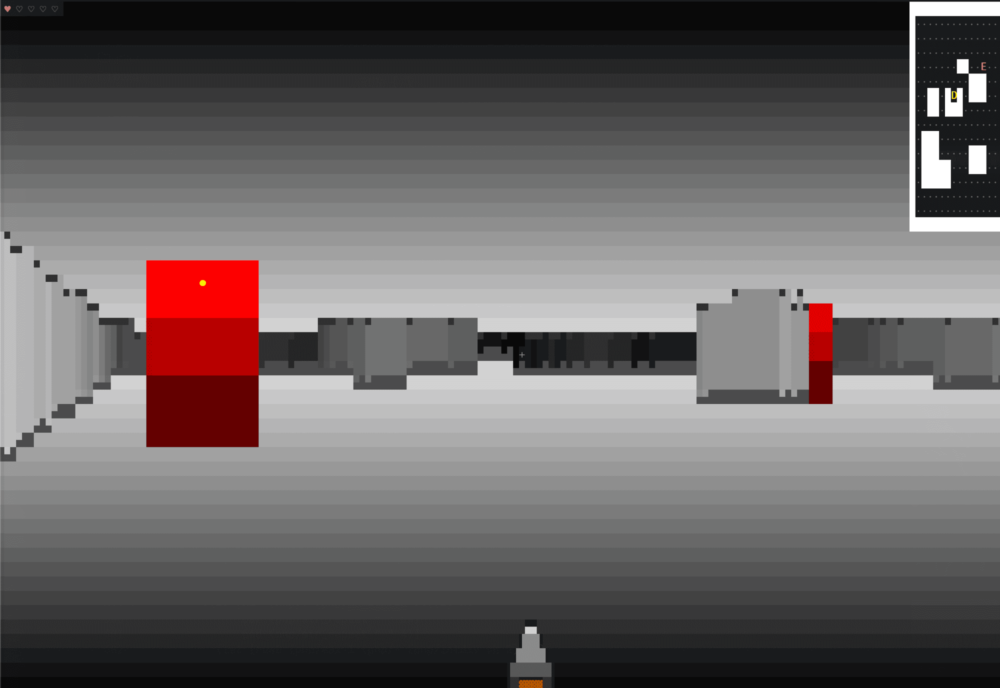

<!--
PRESENTER DECK, Marp.
  npx @marp-team/marp-cli deck.marp.md -o deck.html --allow-local-files   (interactive, press p for notes)
  npx @marp-team/marp-cli deck.marp.md -o deck.pdf --allow-local-files    (clean PDF)
  npx @marp-team/marp-cli -p -w deck.marp.md --allow-local-files          (live preview)
  (--allow-local-files is REQUIRED: the deck embeds assets/screenshot.png)

STRUCTURE: simple → complex. Slides 1-18 = pure Phel basics (no game code).
Slides 19+ = real phel-doom code.
-->

<!-- _class: lead -->
<!-- _paginate: false -->
<!-- _footer: "" -->

# Writing Lisp in PHP

### Learn Phel by building DOOM

**Chemaclass**

<!--
20s. "40 minutes: I'll teach you a Lisp - and prove it's not a toy by showing a DOOM clone I built with it."
Eye contact. No notes.
-->

---

<!-- _paginate: false -->
<!-- _backgroundColor: #0a0a0a -->
<!-- _footer: "" -->



<!--
3s silence. Let it breathe. Say nothing. Let the room realize what they're looking at.
Then click to the claim.
-->

---

<!-- _class: lead -->


# Wait, what?

This is **DOOM**. In a **terminal**.
Written in a **Lisp**. That compiles to **PHP 8.4**.

<span class="small">~11,700 lines of Phel · same raycasting idea as id Software's 1993 original · ~5 ms/frame</span>
<!--
Click in. 3s silence. Let the GIF breathe.
"DOOM. In a terminal. Written in Lisp. Compiled to PHP 8.4."
Name the room: "You're thinking: that can't work in PHP."
-->

---

## What you'll leave with

1. **Why** Phel exists and what makes it different
2. **How** to write it from zero: syntax, data, state
3. **How** it plugs into PHP: all of PHP, the REPL, one CLI
4. **How** immutability shapes a real project: DOOM

> We learn by **building the game**. No spec-reading.

<!--
30s. "Four things: why it exists, how to write it, how it plugs into PHP, and how it builds a real game."
Don't read the list. Signpost and move.
-->

---

## What is Phel?

- A **functional Lisp** that compiles to PHP
- `Clojure -> JVM :: Phel -> PHP`
- Immutability, macros, clean pipelines. 
- All within the PHP ecosystem.
- Just a **Composer package.** No new runtime, no new server.

```bash
composer require phel-lang/phel-lang
```

<span class="reflex">🧠 "New language = new runtime + new hires"? No. It's a Composer package.</span>

<!--
Clojure folks: "Same idea, PHP runtime." Everyone else: "PHP under the hood, written like a Lisp."
Land on: "you require a dependency, not a platform."
-->

---

## It's still PHP under the hood

```bash
vendor/bin/phel build    # compiles .phel → out/*.php
```

- **Ahead-of-time compiled.** Not interpreted at runtime.
- Output is **plain PHP 8.4.** Any host, zero Phel in production.
- **OPcache + JIT** apply for free.
- Ships as `vendor/bin/phel`. One CLI for everything.

> Write Lisp. Ship PHP. Server needs nothing new.
<!--
"You write Lisp. You ship PHP. Server learns nothing new."
Tease: "We'll open the compiled files live later - no magic."
-->

---

<!-- _class: lead -->
# ACT 1
## Phel basics, for PHP developers

<!-- Zero Lisp experience assumed. All examples standalone, no game code yet. -->

---

## The whole syntax, in 30 seconds

```clojure
; operator comes FIRST, no precedence rules
(+ 1 2 3)              ; =>  6 (PHP: 1 + 2 + 3)
(str "Hello " "Phel")  ; =>  "Hello Phel"
(> 5 3)                ; =>  true (PHP: 5 > 3)
```

```clojure
; every form is: ( operator  arg1  arg2 ... )
(+ 1 (* 2 3))  ; =>  7
(= "a" "a")    ; =>  true
(not false)    ; =>  true
```

That's the entire syntax. Everything else is just functions.

<span class="reflex">🧠 `1 + 2 * 3` has precedence rules. In Phel: always `(op args)`, no exceptions.</span>

<!--
"If you can read (+ 1 2), you can read every line in this game."
Tackle parens: "Yes, parentheses. You stop seeing them in ten minutes."
Don't dodge it - name it, defuse it, move.
-->

---

## Variables

**`def`**: immutable top-level binding (PHP: `$x = 5`)

```clojure
(def x 5)
(def greeting "Hello!")
(def active? true)  ; ? suffix = boolean convention
```

**`let`**: local bindings, scoped to the block

```clojure
(let [a 10
      b 20
      total (+ a b)]
  total)  ; =>  30   (a, b, total don't exist outside)
```

<span class="reflex">🧠 PHP: any var is reassignable from anywhere. `def` says "this never changes."</span>

<!--
"? suffix - convention, like PHP's is_ prefix. Not special syntax."
"let is a scoped block. a, b, total vanish after the closing ]."
-->

---

## Functions

```clojure
;; defn name args body  (last expression = return value, no `return`)
(defn greet [name]
  (str "Hello, " name))

(greet "PHP Conf")  ; =>  "Hello, PHP Conf"
```

- `defn` = public · `defn-` = private (unexported)
- Shorthand: `#(* % 2)` = `(fn [x] (* x 2))`  - like `fn($x) => $x * 2`

```clojure
(map #(* % 2) [1 2 3])  ; =>  [2 4 6]
```

<span class="reflex">🧠 PHP: `function greet($n) { return "Hello, ".$n; }` · `fn($x) => $x * 2`</span>

<!--
"No return keyword. Last expression IS the value."
"defn = public, defn- = private. That's the whole access model."
"#() is shorthand for a one-liner fn. % is the argument. You'll see it everywhere."
-->

---

## Data structures

```clojure
{:name "Chema" :age 33}  ; map   (PHP: ["name" => "Chema", "age" => 33])
[:a :b :c]               ; vector, PHP: [0 => "a", 1 => "b", 2 => "c"]
#{:red :green :blue}     ; set   , unique values only
```

**Access** with `get`:

```clojure
(get {:name "Chema"} :name)  ; =>  "Chema"
(get [:a :b :c] 1)           ; =>  :b
```

**Keywords** (`:name`, `:active?`): typed constants, 
like PHP string keys but faster to compare

<span class="reflex">🧠 PHP arrays do everything. Phel separates the concept: map / vector / set.</span>

<!--
PHP translation: "map = assoc array, vector = indexed array, set = unique values."
":name is a keyword - interned, faster to compare than a plain string."
-->

---

## Working with collections

```clojure
(def nums [1 2 3 4 5])

(map #(* % 2) nums)  ; =>  [2 4 6 8 10]
(filter even? nums)  ; =>  [2 4]
(reduce + 0 nums)    ; =>  15
```

```clojure
;; for comprehension: build a new vector with conditions
(for [x :in nums :when (odd? x)] (* x x))  ; =>  [1 9 25]
```

<span class="reflex">🧠 `array_map` / `array_filter` / `array_reduce` - same patterns, first-class in Phel.</span>

<!--
"map, filter, reduce - you already know these. Same concept, cleaner syntax."
"for is like a list comprehension. :when is the filter condition."
-->

---

## Branching

```clojure
;; if is an expression, it returns a value
(if true "yes" "no")      ; =>  "yes"
(if (> 5 3) :big :small)  ; =>  :big
```

```clojure
;; cond = multi-branch, also an expression
(defn grade [score]
  (cond
    (>= score 90) :A
    (>= score 75) :B
    :else         :C))

(grade 82)  ; =>  :B
```

<span class="reflex">🧠 PHP `switch` is a statement. `cond` IS the value, assign it directly.</span>

<!--
"if and cond return a value. No temp variable needed."
Walk grade(82) aloud → :B. One beat. Move.
-->

---

## Threading: pipelines, not nesting

```clojure
; PHP: strtoupper(trim("  hello  "))
; nested = read inside-out. -> = read top-to-bottom:
(-> "  hello  "
    php/trim           ; =>  "hello"
    php/strtoupper)    ; =>  "HELLO"
```

```clojure
; -> passes the value as the FIRST arg of the next call
(-> 10
    (+ 5)     ; (+ 10 5)  =>  15
    (* 2)     ; (* 15 2)  =>  30
    str)      ; (str 30)  =>  "30"
```

<span class="reflex">🧠 `$obj->method()->chain()` needs fluent objects. `->` works on any value.</span>

<!--
"PHP fluent chains need objects. -> works on any value."
Give this a full breath - most useful daily concept.
-->

---

## Loops without mutation

No `while`. No `$i++`. No mutable variables.

```clojure
; loop declares the bindings, recur restarts with new values
(loop [i 0, sum 0]
  (if (= i 5)
    sum                           ; done, return sum
    (recur (inc i) (+ sum i))))   ; =>  10  (0+1+2+3+4)
```

- `loop [i 0, sum 0]`: initial state
- `recur (inc i) (+ sum i)`: next iteration, no stack growth
- Last branch with no `recur`: the return value

<span class="reflex">🧠 `loop` = "start here". `recur` = "next iteration, no new stack frame."</span>

<!--
"loop = initial state. recur = next iteration, no new stack frame."
Foreshadow: "Same shape casts one ray per screen column, ~120-180 a frame in the raycaster. Coming up."
-->

---

<!-- _class: lead -->
# ACT 2
## PHP interop and tooling

<!-- Bridge from Phel concepts to their PHP world. -->

---

## No wall. All of PHP is your stdlib

```clojure
; prefix any PHP function with php/
(php/strtoupper "hello")      ; =>  "HELLO"
(php/strlen "doom")           ; =>  4
(php/date "Y-m-d")            ; =>  "YYYY-MM-DD"
```

```clojure
; PHP objects and methods work too
(def dt (php/new DateTime "2024-01-01"))
(.format dt "Y-m-d")          ; =>  "2024-01-01"   ($dt->format("Y-m-d"))
DateTime/ATOM                  ; =>  "Y-m-d\TH:i:sP"  (::ATOM static const)
```

Any Composer package works.
**Symfony Console** powers this game's CLI.

<span class="reflex">🧠 "But does it have a library for X?" Yes. All of them. It's PHP.</span>

<!--
"Every PHP function, prefixed with php/. There is no wall."
"Objects: php/new to construct. .method to call. ClassName/CONST for statics."
Segue: "Next slide: the REPL - let's try it live."
-->

---

## The REPL: try everything live

```bash
vendor/bin/phel repl
```

```clojure
phel:> (+ 1 2 3)
6
phel:> (defn greet [n] (str "Hello, " n))
phel:> (greet "PHP Conf")
"Hello, PHP Conf"
phel:> {:x 10 :y 20}
{:x 10 :y 20}
phel:> (-> "  hello  " php/trim php/strtoupper)
"HELLO"
```

Load any namespace. Probe any function. No rebuild, no restart.

<!--
DO IT LIVE. 3-4 expressions. Invite: "throw me something."
Breather - don't rush. 90s max, then back to slides.
-->

---

<!-- _class: lead -->
# ACT 3
## Now let's build a game

<!-- Real project code. They know the primitives. Now see them at scale. -->

---

## The entry point

```clojure
(ns phel-doom.main                ; namespace, dot mirrors the path
  (:require phel.cli :as cli)     ; Symfony Console, wrapped in Phel
  (:require phel-doom.commands.play :refer [play-command]))

(def app
  (cli/application
   {:name "phel-doom" :default "play"
    :commands [play-command]}))

(when-not *build-mode*            ; skip side-effects during phel build
  (php/exit (cli/run app (cli/argv argv))))
```

<span class="small">src/main.phel: the bootstrap (version wiring trimmed)</span>

<span class="reflex">🧠 `ns` = namespace. `:require … :as` = `use X as Y`. `:refer` = `use function X`. Same idea, Lisp syntax.</span>

<!--
"ns dot-separated mirrors the file path - same idea as PSR-4 namespaces."
"*build-mode* stops top-level effects during phel build. First clue about compilation."
-->

---

## ...and `play-command` is one loop, forever

`main` just wires the CLI. The whole game is a loop, ~60×/second:

```
  input  ──→  tick-world  ──→  render!  ──┐
  keys        world→world     world→ANSI  │
  held        (pure)          (io)        │
    ▲                                     │
    └─────────── new world ───────────────┘
```

Each frame: `world' = (tick-world world keys dt)`. Draw, discard, repeat.

<span class="reflex">🧠 The whole game is a **fold over keystrokes** - a fresh world each frame.</span>

<!--
VERY high level - don't read code. "main wired the CLI; play IS the game: a loop."
Trace the cycle with your finger: input → tick (pure) → render (io) → back to the top with a NEW world.
"Hold this picture. Next: what's actually IN a world? Then: how one frame transforms it."
-->

---

## The whole game is one immutable value

```clojure
(defn new-world [grid player]
  {:grid    grid
   :player  player       ; {:x :y :angle}
   :enemies []
   :lives   max-lives
   :weapon  :pistol
   :kills   0})          ; ...ammo, armor, doors, etc.
```

This single map **IS the game**.
- diff it to find what changed
- save it to disk for quick-save
- replay it from a seed for deterministic demos
<!--
"Everything you see, shoot, or pick up is in this one map."
Point at :grid, :player, :enemies. "Diff it. Save it. Replay it."
-->

---

## Functions create data, not objects

```php
class Player { // PHP - class + mutation
    public function __construct(
        public float $x, public float $y, public float $angle
    ) {}
}
$p = new Player(2.5, 3.5, 0.0);
$p->angle = 1.57;   // mutates in-place
```

```clojure
; Phel - function + immutable update
(defn new-player [x y angle] {:x x :y y :angle angle})
(new-player 2.5 3.5 0.0)         ; => {:x 2.5 :y 3.5 :angle 0.0}
(assoc player :angle 1.57)        ; => new map, original unchanged
```

<span class="reflex">🧠 Same semantics, half the code. `assoc` returns a new map - original never touched.</span>

<!--
"PHP: class, constructor, getters. Phel: 4-line function, plain map."
Pause after the image. That contrast is the laugh.
-->

---

## One pure frame: `tick-world`

```clojure
(defn tick-world [world keys dt edges]
  (-> world
      (apply-physics dt)     ; movement + collision
      (pickup-hearts)        ; items on the floor
      (tick-enemies dt)      ; enemy AI
      (tick-projectiles dt)  ; fireballs in flight
      (tick-shooting edges)  ; your weapon
      (damage-step dt)))     ; resolve damage
```

Every subsystem is `world -> world`. Old world discarded.
A bug stays **trapped in its subsystem** - it can't corrupt the rest.

<span class="reflex">🧠 PHP: subsystems call each other, mutate shared state. Here: one function in, one function out. Nothing else can touch it.</span>

<!--
"Physics, pickups, enemies, projectiles, shooting, damage - each just world→world."
"Nothing can corrupt anything else. All testable without a terminal."
-->

---

## Architecture: effects in exactly one place

```
io/  →  glue/  →  core/        (dependencies go one way only)
```

- **`core/`:** pure logic (engine, combat, physics). No print, time, or rand.
- **`glue/`:** pure wiring (controls, input parsing).
- **`io/`:** side effects only (render!, audio, files).

```bash
tree src/
# src/core/   src/glue/   src/io/   src/commands/
```

> Purity is not mere taste. Structure enforces it.
<!--
"core/ literally cannot call print or rand. No require, no access."
DO LIVE: tree src/ - point at the three directories.
-->

---

## The trick, in one breath

The world is really a **flat maze on graph paper**:

<div class="split">
<div class="col-text">

```
#######
#.@...#
#.....#
#######
```

**One ray** per column → how far to a wall.

Near = **TALL** strip, far = short. Stack them → **the right view.**

</div>
<div class="col-img">


</div>
</div>

<!--
SET UP the real slide. Say it plain BEFORE the code.
"Forget 3D engines. A maze seen from above, drawn one column at a time."
Gesture: hands wide for tall=close, narrow for far. Then: "now the real version."

DEMO > bare raycaster (split layout: left 3D, right 2D map, walls only):
    phel run phel-doom.main demo --phase 1
-->

---

## DOOM (1993): Carmack's math

**id Software, John Carmack.** A 486 PC. No GPU. Shipped in 11 months.

The same intuition, made exact:

```
; per column:  angle = player_angle + column_offset
;   march the ray to the first wall  →  distance d
;   strip_height = screen_height / d        ; smaller d → taller strip
```

**One division per ray.** No matrix math. No 3D engine.

<span class="reflex">🧠 PHP instinct: reach for a 3D rendering library. Carmack: constrain the world, trust the math.</span>

<!--
Bridge from the previous slide: "that hand-wave, now a formula."
"This is the entire trick - one division per ray."
"Carmack's constraint: no looking up or down, flat floors per room. That keeps the math simple."
Pause. "Now the code. Same algorithm, in Phel. Loop and recur."
-->

---

## `loop/recur`: the heart of DOOM

```clojure
; march a ray forward until it hits a wall
(defn cast-ray [grid x y angle]
  (let [dx (php/cos angle)
        dy (php/sin angle)]
    (loop [dist 0.0]
      (cond
        (> dist max-depth)              max-depth   ; nothing hit
        (wall? grid (+ x (* dist dx))
                    (+ y (* dist dy))) dist         ; hit!
        :else (recur (+ dist 0.05))))))             ; keep stepping
```

No mutable counter. Pure. Unit-test in one line.
**Once per screen column - ~120-180 rays a frame.**
<!--
"Same loop/recur from slide 13 - now casting one ray per screen column, 120-180 a frame."
"SIMPLIFIED: step-march. Real engine uses DDA." Say it once, move on.
Energy: "DOOM 1993. In a terminal. Written in Lisp."

DEMO > build it up live, same engine, one subsystem at a time:
    phel run phel-doom.main demo --phase 2     ; + the pistol
    phel run phel-doom.main demo --phase 3     ; + enemies
    phel run phel-doom.main demo --phase 4     ; + interior cover walls
-->

---

## Testing: pure = no mocks

```clojure
(deftest cast-ray-hits-wall
  (is (= 1.0 (cast-ray simple-grid 1.5 1.5 0.0))))

(deftest pickup-heart-grants-life
  (is (= (+ start-lives 2) (:lives (pickup-hearts world-on-heart)))))  ; one heart = 2 HP
```

```bash
composer test     # 1716 tests, green the whole way
```

No mocks. No fake terminal. No DI container.
Pure functions: call with input, check output. Done.

<!--
"Every pure function is a test waiting to happen."
"What you'd normally mock: clock, RNG, renderer. Nothing to mock here."
-->

---

## Dividend: pure is fast

Target **< 5 ms** per frame · measured **0.2 - 0.5 ms**

- **Memoize** paused frames: a one-line cache, safe because pure.
- Precompute view angles: **-60%** cast time.
- Hot loop: raw PHP arrays, not persistent vectors (**~680x** faster).

<span class="reflex">🧠 Pure = same input, same output. Caching can never be wrong.</span>
<!--
"Memoize was one line. Free and safe - a pure function can't lie."
Honest: "Persistent vectors are beautiful, but ~680x slower in a 7,000-cell hot loop. Reach for raw arrays there."
-->

---

## Read the receipts: Phel → PHP

```clojure
(defn new-player [x y angle] {:x x :y y :angle angle})
```

`phel build` → `out/phel_doom/core/state.php`

```php
\Phel::addDefinition("phel_doom.core.state", "new-player",
  new class() extends \Phel\Lang\AbstractFn {
    public function __invoke($x, $y, $angle) {
      static $__phel_const_0, $__phel_const_1, $__phel_const_2;
      return \Phel::map(
        ($__phel_const_0 ??= \Phel\Lang\Keyword::create("x")), $x,
        ($__phel_const_1 ??= \Phel\Lang\Keyword::create("y")), $y,
        ($__phel_const_2 ??= \Phel\Lang\Keyword::create("angle")), $angle);
    }
  });
```

<!--
DO LIVE: less out/phel_doom/core/state.php
"No magic. PHP you'd recognize. ??= interns keyword once. defn → AbstractFn + __invoke."
BEFORE TALK: run phel build so the file is fresh.
-->

---

<!-- _class: lead -->
# ACT 4
## Story and verdict

<!-- Rising energy. Story → verdict → demo. -->

---

## Built in days, shipped in small steps

- **May 22:** first playable: raycaster + FPS combat
- **May 24:** sprint, 3 weapons, locked doors, boss
- **May 25:** enemy AI state machine + Docker
- **May 27:** 60% faster cast, secret walls, chainsaw
- **Jun 1:** BFG, quick-save, record + replay
- **Jun 2:** super shotgun, rocket, incinerator
- **Jun 3:** distributable PHAR + checksums

**+400 commits.** Tiny PRs, each closing one issue.

<!--
"Not a big bang. One issue, one PR, every day."
"Pure architecture enabled this - each feature bolted on without breaking anything."
-->

---

## The full picture

- **Engine:** raycaster, sprite occlusion, ~5 ms/frame
- **Levels:** 10 generated levels, locked doors, secret walls, automap
- **Combat:** 8 weapons, reload, berserk, hit-stop, fire damage + resists
- **Enemies:** 10 types - imps, demons, pinkies, spectres, fireball casters (caco / baron / archvile), revenants, mancubi, cyberdemon boss
- **Systems:** lives, armor, difficulty, quick-save, record/replay, audio
<!--
Sweep fast. Rising energy into demo.
"Enough slides. Let me show you."
-->

---

<!-- _class: lead -->
# ACT 5
## Live demo

<!-- Deep breath. Terminal is the star now. -->

---

## Demo: `phel run phel-doom.main play`

1. Level 1: move (WASD), turn, strafe, sprint. Walls + minimap.
2. Fire: pistol → shotgun → chaingun. Muzzle flash + hit-stop.
3. Take a hit: damage-direction HUD, armor, lives.
4. Secret wall (`F`), pickup, door → next level.
5. *(if time)* `--god --armory -l 10` → **cyberdemon boss**
6. **`F3` debug overlay** → live ~5 ms frame budget

<!--
~5 min. Narrate: "every frame, a brand-new immutable world."
End on F3: "real budget - callback to slide 28."
BEFORE TALK: terminal font BIG. Boss command in shell history. Fallback video loaded.
-->

---

<!-- _class: lead -->

# Thank you

### https://chemaclass.com/phel-doom

**Questions?** The REPL is open.
<!--
Leave REPL running on screen.
If pause: "We covered why, how to write it, how it integrates, when to use it."
Link stays up. Let people scan or type it.
-->
